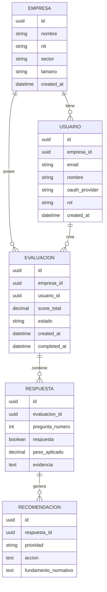

# Documentación Técnica — Cavaltec Privacy Design Check

## 1. Contexto

Este repositorio ahora apunta al reto Cavaltec: una aplicación web segura, intuitiva y multiempresa para autodiagnosticar el cumplimiento de la Ley 1581 de 2012 en fase de diseño.

El código heredado de `backend-agenda/backend` corresponde a un sistema de agenda de citas en Spring Boot. Puede reutilizar piezas transversales como Spring Security, JWT, validación, Swagger y estructura de controladores, pero el dominio debe migrarse a empresas, evaluaciones, respuestas y recomendaciones.

## 2. Producto esperado

La plataforma debe permitir que una organización:

1. Inicie sesión con OAuth.
2. Registre información básica de empresa.
3. Responda un diagnóstico guiado de 11 preguntas.
4. Use un chat asistido por IA para entender preguntas y criterios de respuesta.
5. Obtenga un porcentaje de cumplimiento.
6. Visualice brechas por bloque.
7. Reciba recomendaciones y estrategias de mejora.

## 3. Módulos funcionales

### Autenticación y acceso

- Login OAuth con Google y Microsoft.
- Sesiones stateless con JWT.
- Roles: `admin`, `evaluador`, `auditor`.
- Autorización por empresa y rol.

### Empresa

Campos mínimos:

- `nombre`
- `nit`
- `sector`
- `tamano`

Regla multiempresa:

- Toda evaluación, respuesta y recomendación debe estar asociada a una empresa.
- Un usuario solo puede ver datos de empresas a las que pertenece, salvo rol auditor/admin con permisos explícitos.

### Diagnóstico

El diagnóstico tiene 11 preguntas en 3 bloques:

| Bloque | Preguntas | Peso máximo |
|---|---:|---:|
| Política de datos personales | 1-5 | 40% |
| Privacidad desde el diseño | 6-8 | 36% |
| Gobernanza | 9-11 | 24% |

Reglas:

- P1 es padre de P2-P5. Si P1 = No, P2-P5 no aplican y no suman.
- P11 depende de P10. Si P10 = No, P11 no aplica.
- P11 no suma al score, pero se registra como evidencia de madurez de gobernanza.

### IA y chat

La IA debe operar con contexto controlado:

- Pregunta activa.
- Bloque.
- Respuesta del usuario.
- Artículos relevantes de la Ley 1581.
- Evidencia o comentario proporcionado por la empresa.

Usos:

- Explicar preguntas en lenguaje sencillo.
- Indicar evidencia esperada para responder Sí.
- Ayudar a interpretar respuestas.
- Generar recomendaciones automáticas.
- Priorizar estrategias según peso e impacto.

La base normativa que el backend debe cargar para estos prompts vive en:

```text
backend-agenda/backend/src/main/resources/knowledge-base/
├── cavaltec-autodiagnostico-requisitos.md
└── ley-1581/
    ├── README.md
    ├── 01-objeto-ambito-definiciones.md
    ├── 02-principios-rectores.md
    ├── 03-categorias-especiales-datos.md
    ├── 04-derechos-condiciones-legalidad.md
    ├── 05-procedimientos.md
    ├── 06-deberes-responsables-encargados.md
    ├── 07-vigilancia-sanciones-registro.md
    └── 08-transferencia-internacional.md
```

### Resultados

La vista de resultados debe incluir:

- Porcentaje total de cumplimiento.
- Nivel cualitativo.
- Gauge o indicador visual.
- Brechas por pregunta.
- Cumplimiento por bloque.
- Plan de mejora priorizado.

## 4. Modelo de datos objetivo



## 5. Algoritmo de scoring

```js
const weights = {
  2: 10,
  3: 10,
  4: 10,
  5: 10,
  6: 12,
  7: 12,
  8: 12,
  9: 16,
  10: 8
};

function calculateScore(answers) {
  let score = 0;

  for (const [questionNumber, weight] of Object.entries(weights)) {
    const number = Number(questionNumber);

    if ([2, 3, 4, 5].includes(number) && answers[1] !== true) {
      continue;
    }

    if (answers[number] === true) {
      score += weight;
    }
  }

  return score;
}
```

## 6. Seguridad

Controles esperados:

- Validación server-side con mensajes de error uniformes.
- Autorización por empresa en cada consulta.
- CORS restringido por ambiente.
- CSRF habilitado si se usan cookies de sesión.
- JWT firmados con secreto robusto o llave asimétrica.
- Hashing de secretos con algoritmos modernos cuando aplique.
- Rate limiting para login, chat e IA.
- Sanitización de contenido generado o ingresado por usuarios antes de renderizar.
- Logs sin datos sensibles.
- Separación de configuración por variables de entorno.

Riesgos OWASP priorizados:

| Riesgo | Mitigación esperada |
|---|---|
| Broken Access Control | Verificación de `empresa_id` y rol en cada endpoint |
| Cryptographic Failures | TLS, secretos fuera del repositorio, tokens de vida corta |
| Injection | ORM, queries parametrizadas y validación de DTO |
| Insecure Design | Privacy by Design, minimización, threat modeling |
| Security Misconfiguration | CORS restringido, headers seguros, perfiles por ambiente |
| Identification and Authentication Failures | OAuth robusto, validación de audiencias, expiración |
| Software and Data Integrity Failures | Dependencias auditadas, CI, control de versiones |
| Logging and Monitoring Failures | Alertas de accesos anómalos e incidentes |

## 7. Estado de implementación

### Implementado

- Base normativa Markdown en `backend-agenda/backend/src/main/resources/knowledge-base/ley-1581`.
- Definición del reto en `backend-agenda/backend/src/main/resources/knowledge-base/cavaltec-autodiagnostico-requisitos.md`.
- App frontend estática en `frontend-agenda/privacy-design-check`.
- Cálculo de scoring y brechas en cliente.
- Chat local de asistencia normativa.
- Dashboard visual de resultados.

### Pendiente

- Migración del backend al dominio Cavaltec.
- Persistencia real de empresas, usuarios, evaluaciones y respuestas.
- OAuth real con Google y Microsoft.
- Integración con proveedor LLM.
- Reportes PDF.
- Histórico de evaluaciones.
- Pruebas automatizadas del nuevo dominio.
